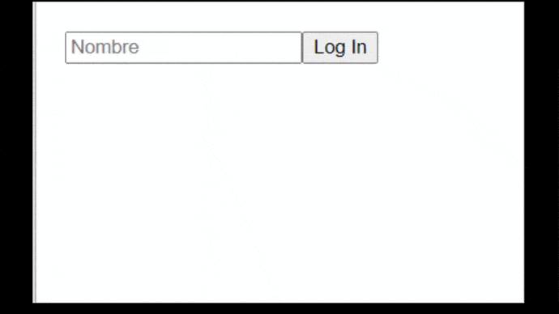

# React Redux with Hooks

Redux es un patron de arquitectura de datos que permite manejar el estado de la app de forma global

En React, el state fluye de componente a componente mediante de props. Pero al crecer una app, se hace necesario manejar el state como un estado global (store) permitiendo que cualquier componente pueda acceder a el, y cambiarlo (condiciones aplican)

<center> 
</center>

## Principios Basicos de Redux

- El store es la unica fuente de la verdad
- El state es solo de lectura (inmutable)
- Los cambios se hacen por medio de Acciones (Actions) y funciones puras (Reducers)

## Partes de Redux

### El Store

Es el objeto central que contiene el state de la aplicacion. Es creado usando el metodo **_createStore_** que importamos de la libreria redux. Se le pasa como parametro los reducers

```js
import { createStore } from ‘redux’;
const store = createStore(reducer);
```

### Actions

El action es un objecto que contienen la informacion que necesita ser cambiada y es enviada al store. Al menos contiene un type el cual por convencion es un nombre descriptivo escrito en uppercase se estila crear un archivo store.js, y este llamarlo en el app.js. Para asi dejar mas limio.

Adicional se le puede pasar un _payload_ que es la info a cambiar. puede ser un objeto,array, un string, o boleano

```js
{
   type: ADD_ITEM,
   payload: {name: ‘Iphone XX’, price: 100000}
}
```

Se puede usar **_Action Creators_** que son funciones que retornan acciones(los objetos que se le pasan al dispatch del store).
Son opcionales pero es una buena practica usarlas.

Asi que el ejemplo anterior en vez de pasar una accion,
se utilizaria una funcion que contruye el action, quedando
asi.

```js
const newItem = item => {
  return {
    type: ADD_ITEM,
    payload: {
      name: ‘Iphone XX’, price: 100000}
  }
}

// y para invocarlos seria
dispatch(newItem(item))
```

### Reducers

Los reducers son funciones puras de javascript que reciben dos parametros. El estado anterior y una accion.
El reducer devuelve un nuevo state de la aplicacion.

El state no es cambiado directamente, sino q se saca una copia del state y al nuevo state se actualiza mediante alguna funcion.

Los reducers se ayudan con el uso de switch, que permite estudiar cada caso action.type y devolver un stado nuevo dependiendo del caso

<center></center> Flujo de Redux

## Implementacion Redux con React

Con el fin de poder ejemplificar redux, hagamos una pequeña app que utilice las practicas convencionales.


## Pasos

Primero crear un basico de React con

`npx create-react-app redux-start`

instalar las dos dependecias necesarias de redux que seria

`npm i redux react-redux`

La estructura de carpeta siempre varia segun la persona,
si bien existen convenciones y buenas practicas,
siempre existen ligeras diferencias.
Se estila crear un archivo store.js, y este
llamarlo en el app.js. El
boilerplate de redux puede ser un poco grande
y a veces repetitivo. En ejemplos pequeños se evita
usar las subcarpetas por comodidad y rapidez,
pero si buscas rapidez y comodidad en una app
pequeña, quizas es mejor irse con usecontext o
directamente con props.

La convencion indica que dentro de .src/ se estila crear un archivo store.js,
y este llamarlo en el app.js. luego crear subcarpetas individuales
para los actions, reducers y types
Aun se puede ir mas alla y crear una carpeta llamada
redux y colocar todo dentro alli ordenado por
subcarpeta y asi mantener mas ordenado
la estructura de folder. Hagamos eso.

Se crea
.src/redux/actions
.src/redux/reducers
.src/redux/types
.src/redux/store.js

Se hace un ejemplo donde tenemos dos estados separados, uno para incrementaun contador, y el otro que maneje el stato del login del usuario.

### Types

Los types es simplemente un nombre que por
convencion se utiliza uppercase. Como valor va lo que ira en el redux dev tools.
Debe ser algo descriptivo

```js
//.src/redux/types/types.js

export const types = {
  SUMAR: "[contadorReducer] SUMAR",
  RESTAR: "[contadorReducer] RESTAR",

  LOG_IN: "[LoginReducer] Login",
  LOG_OUT: "[LoginReducer] Logout",
};
```

Se nota facilmente dos bloques correspondientes los type de cada store

### Actions

El action se puede generar uno por cada estado
y despues se importan combinados, o se usa un solo
archivo pero se separan para que visualmente se vea
un bloque que corresponde a los actions de un store
vs los otros actions.

se crea

```js
import { types } from "../types/types";

export const sumar = () => {
  return {
    type: types.SUMAR,
  };
};

export const restar = () => {
  return {
    type: types.RESTAR,
  };
};

export const logIn = (usuario) => {
  return {
    type: types.LOG_IN,
    payload: usuario,
  };
};

export const logOut = () => {
  return {
    type: types.LOG_OUT,
  };
};
```

### Reducers

Si bien el store inicial que esta en el archivo de reducer deberia ser uno solo, se puede usar varios store para dar mas orden y se combinan con _combineReducers from "redux"_;

Se hace un ejemplo donde tenemos dos estados separados, uno para incrementa un contador, y el otro que maneje el state del login del usuario.

De esta forma se puede utilizar varios archivos de store, pero a la final se exporta uno solo como reducer. Tendremos dos gupo de valores que son _contador_ y _login_

```js
//.src/redux/reducers/contadorReducer.js
import { types } from "../types/types";

export const contadorReducer = (state = 0, action) => {
  switch (action.type) {
    case types.SUMAR:
      return state + 1;

    case types.RESTAR:
      return state - 1;

    default:
      return state;
  }
};
```

```js
//.src/redux/reducers/loginReducer.js
import { types } from "../types/types";

const initialState = { usuario: null, usuarioLogueado: false };

export const loginReducer = (state = initialState, action) => {
  switch (action.type) {
    case types.LOG_OUT:
      return { ...state, usuario: null, usuarioLogueado: false };

    case types.LOG_IN:
      return { ...state, usuario: action.payload, usuarioLogueado: true };

    default:
      return state;
  }
};
```

La estructura de los reducers es en forma de switch. Se importan los types. los reducers reciben dos parametros, el state que puede ser un arreglo con un state inicial y las acciones (el type y el payload).
Es importante siempre devolver un default: return state;

### Llevando los reducers al state

Ya tenemos los types que son los nombres para usar en los actions que va a llamar con ese nombre a los reducers y va a ejecutar una funcion retornando un nuevo state. Ahora hay que colocar el state en la app para que este disponible.

Por convencion se estila crear un archivo store.js, y este llamarlo en el app.js para asi dejar mas limpio este ultimo.

```js
//.src/redux/store.js
import { combineReducers, createStore, compose } from "redux";
import { contadorReducer } from "./reducers/contadorReducer";
import { loginReducer } from "./reducers/loginReducer";

const composeEnhancers =
  (typeof window !== "undefined" &&
    window.__REDUX_DEVTOOLS_EXTENSION_COMPOSE__) ||
  compose;

const reducers = combineReducers({
  contador: contadorReducer,
  login: loginReducer,
});

const store = createStore(reducers, composeEnhancers());

export default store;
```

Se importa importa {createStore} que como su nombre lo dice, crea el store.
Importamos los reducers y los combinamos con _combineReducers_, tambien se estila combinarlos en un previo archivo e importar el archivo.

Para aprovechar el redux devtools, debemos se agrega un codigo adicional que proporciona el desarrolador. A la final se exporta todo como store.

Y ahora se configura preferiblemente enm el app.js el store, pq es un sitio idoneo para que toda la applicacion quede envuelta con el store.

Usamos _provider_ que nos los proporciona la libreria de react-redux, importamos tambien el store que es el archivo creado anteriormente, resultando en un archivo de la siguiente forma

```js
import React from "react";
import Main from "./component/Main";
import { Provider } from "react-redux";
import store from "./redux/store";

function App() {
  return (
    <Provider store={store}>
      <Main />
    </Provider>
  );
}

export default App;
```

Y listo, ya con esto tenemos el store disponible para ser utilizado por cualquier componente de la app. Falta aprender a usar el useSelector y el useDispatch que son hooks de react-redux

- useSelector() el cual permite extraer datos de una store de Redux.
- useDispatch() que devuelve el cual devuelve una función que usaremos para enviar acciones al store.

Para el ejemplo se creo un componente Main donde esta toda la logica, y se puede apreciar el uso de estos hooks.

Primero importamos
`import { useDispatch, useSelector } from "react-redux";`
`import actions from "../redux/actions/actions";`

con `const dispatch = useDispatch()` tendiramos todos los actions disponibles para llamarlos a traves de un evento segun sea el caso necesario.

en el ejemplo, el store posse dos propiedads, contador y login. Mediante a el hooks de _useSelector_ accedemos aella

```js
const login = useSelector((state) => state.login);
const contador = useSelector((state) => state.contador);
```

podriamos traer`const state = useSelector(state => state); console.log(state)` para ver como esta compuesto nuestro store

Para modificar el store, usando el dispatch queda asi:
`dispatch(actions.restar());`
`<button onClick={() => dispatch( actions.restar ())}>Restar</button>`

Para terminar de ver el proyecto funcionando, accedan al repo.[Repo Redux](https://github.com/ejbcode/react_redux_basic)
